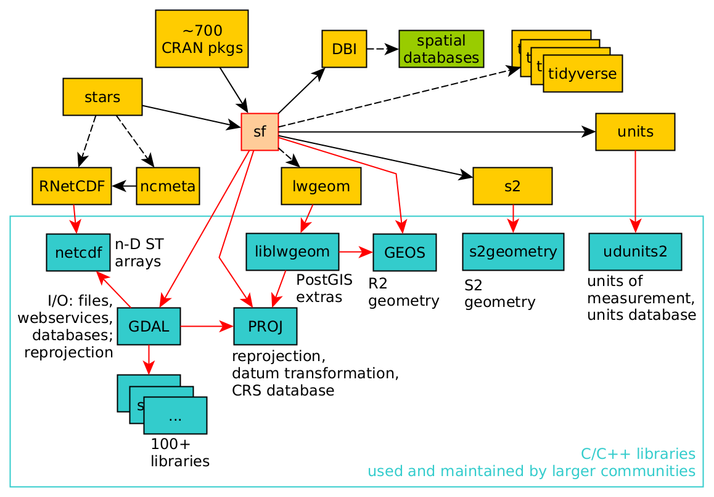

```{r}
library(tidyverse)
library(sf)
```

# First map

```{r}
nc <- system.file("gpkg/nc.gpkg",
                  package = "sf") |> read_sf()
nc.32119 <- st_transform(nc, "EPSG:32119")
nc.32119 |> 
  select(BIR74) |> 
  plot(graticule = T, axes = T)
```

```{r}
nc |> select(AREA, BIR74, SID74) |> 
  print(n = 3)
```

## Facet

```{r}
year_labels <- c("SID74" = "1974 - 1978", "SID79" = "1979 - 1984")
nc_longer <- nc.32119 |> 
  select(SID74, SID79) |> 
  pivot_longer(starts_with("SID"))
```

```{r}
ggplot(nc_longer) +
  geom_sf(aes(fill = value), linewidth = 0.4) +
  facet_wrap(~ name, ncol = 1, labeller = labeller(name = year_labels)) +
  scale_y_continuous(breaks = 34:36) +
  scale_fill_gradientn(colors = sf.colors(20)) +
  theme(panel.grid.major = element_line(color = "white"))
```

## with Leaflet

```{r}
library(mapview)
```

```{r}
mapviewOptions(fgb = F)
nc.32119 |> mapview(zcol = "BIR74",
                    legend = T,
                    col.regions = sf.colors())
```

# Raster and vector data

```{r}
library(stars)
```

```{r}
x <- read_stars(system.file("tif/L7_ETMs.tif", package = "stars"))[,,,1]
```

```{r}
par(mfrow = c(2, 2))
par(mar = rep(1, 4))
image(x, main = "(a)")
image(x[,1:10, 1:10], text_values = T,
      border = "grey", main = "(b)")
image(x, main = "(c)")
set.seed(131)
pts <- st_sample(st_as_sfc(st_bbox(x)), 3)
plot(pts, add = T, pch = 3, col = "blue")
image(x, main = "(d)")
plot(st_buffer(pts, 500), add = T, pch = 3, 
     border = "blue", col = NA, lwd = 2)
```

Vector and raster data can be combined in different ways; for instance we can query the raster at the three points of Figure 1.4(c) or compute an aggregate, such as the average, over arbitrary regions such as the circles shown in Figure 1.4(d).

```{r}
st_extract(x, pts)
```

```{r}
aggregate(x, st_buffer(pts, 500), FUN = mean) |> 
  st_as_sf()
```

## Vector to raster

```{r}
plot(st_rasterize(nc["BIR74"], dx = 0.1),
     col = sf.colors(), breaks = "equal")
```

# Raster types

```{r}
x <- 1:5
y <- 1:4
d <- st_dimensions(x = x, y = y, .raster = c("x", "y"))
m <- matrix(runif(20),5,4)
r1 <- st_as_stars(r = m, dimensions = d)

r <- attr(d, "raster")
r$affine <- c(0.2, -0.2)
attr(d, "raster") = r
r2 <- st_as_stars(r = m, dimensions = d)

r <- attr(d, "raster")
r$affine <- c(0.1, -0.3)
attr(d, "raster") = r
r3 = st_as_stars(r = m, dimensions = d)

x <- c(1, 2, 3.5, 5, 6)
y <- c(1, 1.5, 3, 3.5)
d <- st_dimensions(x = x, y = y, .raster = c("x", "y"))
r4 <- st_as_stars(r = m, dimensions = d)

grd <- st_make_grid(cellsize = c(10,10), offset = c(-130,10), n = c(8,5), crs = st_crs('OGC:CRS84'))
r5 <- st_transform(grd, "+proj=laea +lon_0=-70 +lat_0=35")

par(mfrow = c(2,3), mar = c(0.1, 1, 1.1, 1))
r1 <- st_make_grid(cellsize = c(1,1), n = c(5,4), offset = c(0,0))
plot(r1, main = "regular")
plot(st_geometry(st_as_sf(r2)), main = "rotated")
plot(st_geometry(st_as_sf(r3)), main = "sheared")
plot(st_geometry(st_as_sf(r4, as_points = FALSE)), main = "rectilinear")
plot(st_geometry((r5)), main = "curvilinear")
```

# Spacial data science software




